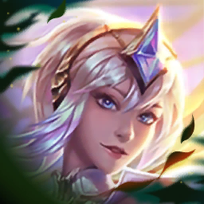
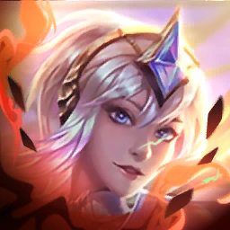
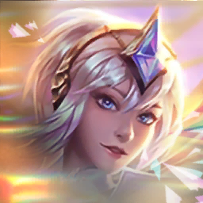

# Enchanted Wilds - Set package overview

Generated from the validated Set source specification. Images use local package paths.

- Champions: 65
- Traits: 36
- Items: 136

## Champions

| Image | Champion | Cost | Traits | Trait points | Slots |
| --- | --- | ---: | --- | --- | ---: |
|  | Gromp | 2 | Riftbeast, Adaptor | DA_Riftbeast18=1, DA_18_Adaptor=1 | 1 |
|  | Murkwolf | 2 | Riftbeast, Ravager | DA_Riftbeast18=1, DA_18_Slayer=1 | 1 |
|  | Pebbles | 1 | Riftbeast, Invoker | DA_Riftbeast18=1, DA_18_Invoker=1 | 1 |
|  | Cinderling | 1 | Riftbeast, Hunter | DA_Riftbeast18=1, DA_18_Hunter=1 | 1 |
|  | Scuttlecrab | 2 | Riftbeast, Juggernaut | DA_Riftbeast18=1, DA_Juggernaut18=1 | 1 |
|  | Krug | 3 | Riftbeast, Brawler | DA_Riftbeast18=1, DA_18_Brawler=1 | 1 |
|  | Sentinel | 4 | Riftbeast, Vanguard, Invoker | DA_Riftbeast18=1, DA_18_Vanguard=1, DA_18_Invoker=1 | 1 |
|  | Brambleback | 4 | Riftbeast, Ravager | DA_Riftbeast18=1, DA_18_Slayer=1 | 1 |
|  | Xayah | 1 | Elderwood, Fae, Rapidfire | DA_18_Elderwood=1, DA_18_Fae=1, DA_18_Rapidfire=1 | 1 |
|  | Ornn | 1 | Elderwood, Defender | DA_18_Elderwood=1, DA_18_Defender=1 | 1 |
|  | Nidalee | 4 | Primal, Adaptor | DA_Primal18=1, DA_18_Adaptor=1 | 1 |
|  | Hecarim | 3 | Elderwood, Vanguard | DA_18_Elderwood=1, DA_18_Vanguard=1 | 1 |
|  | Ezreal | 4 | Elderwood, Executioner | DA_18_Elderwood=1, DA_18_Executioner=1 | 1 |
|  | Azir | 3 | Blackthorn, Executioner, Summoner | DA_18_Blackthorn=1, DA_18_Executioner=1, DA_18_Summoner=1 | 1 |
|  | Rek'Sai | 1 | Blackthorn, Brawler | DA_18_Blackthorn=1, DA_18_Brawler=1 | 1 |
|  | Veigar | 1 | Blackthorn, Sprykin, Spellweaver | DA_18_Blackthorn=1, DA_18_Sprykin=1, DA_18_Spellweaver=1 | 1 |
|  | Maokai | 5 | Old Growth, Juggernaut | DA_18_Maokai_UniqueTrait=1, DA_Juggernaut18=1 | 1 |
|  | Malphite | 4 | Blackthorn, Monolith | DA_18_Blackthorn=1, DA_18_Battlemage=1 | 1 |
|  | Yorick | 1 | Blossom, Juggernaut, Summoner | DA_18_Blossom=1, DA_Juggernaut18=1, DA_18_Summoner=1 | 1 |
|  | Yunara | 2 | Blossom, Executioner | DA_18_Blossom=1, DA_18_Executioner=1 | 1 |
|  | Sett | 4 | Blossom, Brawler | DA_18_Blossom=1, DA_18_Brawler=1 | 1 |
|  | Ahri | 4 | Blossom, Spellweaver | DA_18_Blossom=1, DA_18_Spellweaver=1 | 1 |
|  | Ashe | 5 | Blossom, Hunter | DA_18_Blossom=1, DA_18_Hunter=1 | 1 |
|  | Elise | 2 | Coven, Vanguard | DA_18_Coven=1, DA_18_Vanguard=1 | 1 |
|  | Caitlyn | 2 | Coven, Hunter | DA_18_Coven=1, DA_18_Hunter=1 | 1 |
|  | Cassiopeia | 3 | Coven, Spellweaver | DA_18_Coven=1, DA_18_Spellweaver=1 | 1 |
|  | Morgana | 4 | Coven, Invoker | DA_18_Coven=1, DA_18_Invoker=1 | 1 |
|  | Rakan | 1 | Fae, Juggernaut, Vanguard | DA_18_Fae=1, DA_Juggernaut18=1, DA_18_Vanguard=1 | 1 |
|  | Lillia | 4 | Fae, Defender | DA_18_Fae=1, DA_18_Defender=1 | 1 |
|  | Kobuko | 1 | Sprykin, Brawler | DA_18_Sprykin=1, DA_18_Brawler=1 | 1 |
|  | Teemo | 2 | Sprykin, Invoker | DA_18_Sprykin=1, DA_18_Invoker=1 | 1 |
|  | Rammus | 3 | Sprykin, Defender | DA_18_Sprykin=1, DA_18_Defender=1 | 1 |
|  | Gnar | 5 | Elderwood, Sprykin, Brawler | DA_18_Elderwood=1, DA_18_Sprykin=1, DA_18_Brawler=1 | 1 |
|  | Tristana | 3 | Fae, Sprykin, Hunter | DA_18_Fae=1, DA_18_Sprykin=1, DA_18_Hunter=1 | 1 |
|  | Sivir | 4 | Primal, Hunter | DA_Primal18=1, DA_18_Hunter=1 | 1 |
|  | Vi | 3 | Primal, Juggernaut | DA_Primal18=1, DA_Juggernaut18=1 | 1 |
|  | Akali | 1 | Inferno, Adaptor, Ravager | DA_18_Inferno=1, DA_18_Adaptor=1, DA_18_Slayer=1 | 1 |
|  | Varus | 1 | Inferno, Rapidfire | DA_18_Inferno=1, DA_18_Rapidfire=1 | 1 |
|  | Amumu | 4 | Inferno, Juggernaut | DA_18_Inferno=1, DA_Juggernaut18=1 | 1 |
|  | Kennen | 5 | Inferno, Executioner | DA_18_Inferno=1, DA_18_Executioner=1 | 1 |
|  | Aphelios | 4 | Lunar, Rapidfire | DA_18_Lunar=1, DA_18_Rapidfire=1 | 1 |
|  | Diana | 3 | Lunar, Ravager, Vanguard | DA_18_Lunar=1, DA_18_Slayer=1, DA_18_Vanguard=1 | 1 |
|  | Alune | 5 | Attuned, Lunar, Spellweaver | DA_AluneUniqueTrait18=1, DA_18_Lunar=1, DA_18_Spellweaver=1 | 1 |
|  | Leona | 1 | Solar, Defender | DA_18_Solar=1, DA_18_Defender=1 | 1 |
|  | Kayle | 2 | Solar, Rapidfire | DA_18_Solar=1, DA_18_Rapidfire=1 | 1 |
|  | Sejuani | 2 | Solar, Juggernaut | DA_18_Solar=1, DA_Juggernaut18=1 | 1 |
|  | Kha'Zix | 3 | Rival | DA_18_Rival=1 | 1 |
|  | Rengar | 3 | Rival | DA_18_Rival=1 | 1 |
|  | Kog'Maw | 3 | Caustic, Adaptor, Invoker | DA_18_Caustic=1, DA_18_Adaptor=1, DA_18_Invoker=1 | 1 |
|  | Zyra | 4 | Thornmaiden, Summoner | DA_18_ZyraUniqueTrait=1, DA_18_Summoner=1 | 1 |
|  | Fiddlesticks | 3 | Flora Fatalis, Defender, Spellweaver | DA_FloraFatalis18=1, DA_18_Defender=1, DA_18_Spellweaver=1 | 1 |
|  | Soraka | 4 | Flora Fatalis, Executioner | DA_FloraFatalis18=1, DA_18_Executioner=1 | 1 |
|  | Taric | 5 | Emerald Aspect, Vanguard | DA_Emerald18=1, DA_18_Vanguard=1 | 1 |
|  | Ivern | 5 | Greenfather | DA_18_Greenfather=1 | 1 |
|  | Alistar | 2 | Elderwood, Brawler | DA_18_Elderwood=1, DA_18_Brawler=1 | 1 |
|  | Draven | 5 | Bounty Seeker | DA_DravenUniqueTrait18=1 | 1 |
|  | Elder Dragon | 5 | Apex Predator, Riftbeast | DA_18_ApexPredator=1, DA_Riftbeast18=2 | 2 |
|  | Karma | 1 | Blossom, Spellweaver | DA_18_Blossom=1, DA_18_Spellweaver=1 | 1 |
|  | LeBlanc | 2 | Elderwood, Spellweaver | DA_18_Elderwood=1, DA_18_Spellweaver=1 | 1 |
|  | Master Yi | 3 | Blossom, Adaptor | DA_18_Blossom=1, DA_18_Adaptor=1 | 1 |
|  | Shen | 2 | Inferno, Defender | DA_18_Inferno=1, DA_18_Defender=1 | 1 |
|  | Warwick | 2 | Blackthorn, Ravager | DA_18_Blackthorn=1, DA_18_Slayer=1 | 1 |
|  | Camille | 1 | Coven, Ravager | DA_18_Coven=1, DA_18_Slayer=1 | 1 |
|  | Mama Beak | 3 | Riftbeast, Summoner, Rapidfire | DA_Riftbeast18=1, DA_18_Summoner=1, DA_18_Rapidfire=1 | 1 |
|  | Lux | 5 | Avatar | DA_18_LuxUniqueTrait=1 | 1 |

## Dynamic Trait choices

| Champion | Rule | Scope | Choice | Points | Choice image |
| --- | --- | --- | --- | ---: | --- |
| Kha'Zix | ZERO_OR_ONE | PER_CHAMPION | Executioner | 1 | - |
| Kha'Zix | ZERO_OR_ONE | PER_CHAMPION | Rapidfire | 1 | - |
| Kha'Zix | ZERO_OR_ONE | PER_CHAMPION | Ravager | 1 | - |
| Kha'Zix | ZERO_OR_ONE | PER_CHAMPION | Spellweaver | 1 | - |
| Lux | EXACTLY_ONE | PER_CHAMPION | Blackthorn | 2 |  |
| Lux | EXACTLY_ONE | PER_CHAMPION | Blossom | 2 |  |
| Lux | EXACTLY_ONE | PER_CHAMPION | Coven | 2 |  |
| Lux | EXACTLY_ONE | PER_CHAMPION | Elderwood | 2 |  |
| Lux | EXACTLY_ONE | PER_CHAMPION | Fae | 2 |  |
| Lux | EXACTLY_ONE | PER_CHAMPION | Inferno | 2 |  |
| Lux | EXACTLY_ONE | PER_CHAMPION | Lunar | 2 |  |
| Lux | EXACTLY_ONE | PER_CHAMPION | Solar | 2 |  |
| Lux | EXACTLY_ONE | PER_CHAMPION | Primal | 2 |  |

## Traits

| Icon | Trait | Breakpoints | Activation | Derived from | Description |
| --- | --- | --- | --- | --- | --- |
|  | Elderwood | 3 (tier_1): A Stonebark Tree and a Lifebloom / 5 (tier_3): A second Stonebark Tree and Stonebark Trees gain 200 Health / 7 (tier_5): and the Deepwood Protector / 9 (tier_5): Plants star up to 2-star / 11 (tier_6): Plants star up to 3-star and the forest comes to life | AT_LEAST | - | Gain placeable Elderwood plants. |
|  | Avatar | 1 (tier_4) | AT_LEAST | - | Having an Avatar on your bench or board transforms all other Avatars in your shop to the Trait of that Avatar. An Avatar's chosen Trait is counted twice for Trait bonuses. |
|  | Ravager | 2 (tier_1): 12% Bonus Damage / 4 (tier_3): 25% Bonus Damage / 6 (tier_5): 40% Bonus Damage | AT_LEAST | - | Ravagers gain 10% Omnivamp. Additionally, Ravagers deal bonus damage, doubled against units below 50% Health. |
|  | Bounty Seeker | 1 (tier_4) | AT_LEAST | - | Choose a bounty. Your strongest Draven can progress on the bounty to earn its reward. Upon completing a bounty, choose another. |
|  | Solar | 3 (tier_5): Your champions gain a 5% max Health shield and deal 8% bonus magic damage. Gain additional bonuses for each unique 3-star champion: 1 : Increase shield and magic damage by 1% for each 3-star. 3 : 15% Attack Speed and 15 Armor and Magic Resist 5 : Convert 40% of the bonus magic damage to true damage. 8 : Every 4 seconds of combat, a 3-star champion ascends to 4-star. | AT_LEAST | - | Your champions gain a 5% max Health shield and deal 8% bonus magic damage. Gain additional bonuses for each unique 3-star champion: 1 : Increase shield and magic damage by 1% for each 3-star. 3 : 15% Attack Speed and 15 Armor and Magic Resist 5 : Convert 40% of the bonus magic damage to true damage. 8 : Every 4 seconds of combat, a 3-star champion ascends to 4-star. |
|  | Sprykin | 3 (tier_1): The Rider gains 15% Health and 15% Attack Speed / 5 (tier_3): 40% Health 35% Attack Speed , and 50% of the BFF's Ability applies to your Sprykin champions. / 7 (tier_5): 45% Health 45% Attack Speed , and 100% of the BFF's Ability applies to your Sprykin champions. | AT_LEAST | - | Gain the Big Furry Friend. Drop a Sprykin on the BFF to pick its Rider. |
|  | Adaptor | 2 (tier_1): 25% OR / 3 (tier_3): 35% OR / 4 (tier_5): 50% OR | AT_LEAST | - | Innate: Adaptor abilities change depending on if their Attack Damage or Ability Power is higher. Adaptors gain Ability Power or Attack Damage, depending on which is higher. |
|  | Coven | 3 (tier_1): 2 Essence per kill, 22 Essence per loss / 4 (tier_3): 2 per kill, 28 per loss / 5 (tier_3): 3 per kill, 35 per loss / 7 (tier_5): 10 per kill, 60 per loss | AT_LEAST | - | Gather Essence by killing champions, plus more by losing player combat. Beginning at 40 Essence, choose to convert Essence to rewards or continue gathering Essence. Each reward requires increasing amounts of Essence. |
|  | Eclipse | 1 (tier_1) | AT_LEAST | DA_18_Lunar>=3, DA_18_Solar>=3 | After 10 seconds of combat, the Eclipse kills the lowest Health enemy, repeating every 3.5 seconds. |
|  | Hunter | 2 (tier_1): 20% AD / 3 (tier_3): 30% AD / 4 (tier_3): 40% AD / 5 (tier_5): 60% AD | AT_LEAST | - | Hunters gain Attack Damage. If a Hunter hasn't swapped targets for 3 seconds, they gain 10% Damage Amp. |
|  | Old Growth | 1 (tier_4) | AT_LEAST | - | Whenever an enemy within 3 hexes dies, your strongest Old Growth champion gains 30 permanent max Health. Current: 0 |
|  | Monolith | 1 (tier_4) | AT_LEAST | - | Monoliths gain 10 Armor and Magic Resist for each enemy targeting them. |
|  | Primal | 2 (tier_1) / 4 (tier_5) | AT_LEAST | - | Choose one of four Primal Blessings. |
|  | Greenfather | 1 (tier_4) | AT_LEAST | - | Gain 1 seed when your strongest Ivern casts, plus 3 every combat. Ivern uses 5 seeds to grow a hex on your board that grants a bonus to its occupant. Seeds: 0 / 5 Current Biome: |
|  | Invoker | 2 (tier_1): 1 Mana Regen \| 3 Mana Regen / 3 (tier_3): 1 Mana Regen \| 4 Mana Regen / 4 (tier_3): 2 Mana Regen \| 6 Mana Regen / 5 (tier_5): 2 Mana Regen \| 8 Mana Regen | AT_LEAST | - | Your team gains Mana Regen, increased for Invokers. |
|  | Rapidfire | 2 (tier_1): +3% Attack Speed per Attack / 3 (tier_3): +5% Attack Speed per Attack / 4 (tier_3): +9% Attack Speed per Attack / 5 (tier_5): +15% Attack Speed per Attack | AT_LEAST | - | Your team gains 10% Attack Speed. Rapidfire champions gain more on every attack, up to 10 stacks. |
|  | Juggernaut | 2 (tier_1): 4% Durability or 20% Durability / 4 (tier_3): 6% Durability or 33% Durability / 6 (tier_5): 8% Durability or 45% Durability | AT_LEAST | - | Your team gains Durability. Juggernauts gain more. |
|  | Inferno | 2 (tier_1): 1% Burn, 33% Wound / 3 (tier_3): After combat, 1 of your shop slots without an Inferno champion ignites, rolling a champion one tier higher / 5 (tier_5): Ignite 2 shop slots, 3% Burn / 7 (tier_5): Ignite 4 shop slots, 4% Burn | AT_LEAST | - | Inferno damage Burns and Wounds enemies for 3 seconds. Inferno Burns stack with other Burns. |
|  | Attuned | 1 (tier_4) | AT_LEAST | - | Your strongest Alune cycles to a new phase of the moon after each cast. While the moon is at or below half full, your team gains 7% Durabilty. While above, your team gains 7% Damage Amp. |
|  | Rival | 1 (tier_1): Rivals collect takedowns, gaining 3 if they takedown another Rival. Takedowns evolve Kha'Zix, permanently granting him your choice of Executioner, Rapidfire, Ravager, or Spellweaver. Rengar grants 2/3/5 gold every 8 takedowns. After 30 takedowns, your team gains 5% Attack Damage plus 0.2% AD per additional takedown. Kha'Zix Takedowns: 0 / 0 Rengar Takedowns: 0 Gold Earned: 0 | EXACT | - | Rivals collect takedowns, gaining 3 if they takedown another Rival. Takedowns evolve Kha'Zix, permanently granting him your choice of Executioner, Rapidfire, Ravager, or Spellweaver. Rengar grants 2/3/5 gold every 8 takedowns. After 30 takedowns, your team gains 5% Attack Damage plus 0.2% AD per additional takedown. Kha'Zix Takedowns: 0 / 0 Rengar Takedowns: 0 Gold Earned: 0 |
|  | Vanguard | 2 (tier_1): 18% max Health / 4 (tier_3): 30% max Health / 6 (tier_5): 40% max Health. Gain 5% Durability while Shielded. | AT_LEAST | - | At Combat Start and after dropping below 50% Health, Vanguards gain a max Health Shield for 10 seconds. |
|  | Brawler | 2 (tier_1): 25% Health / 4 (tier_3): 40% Health / 6 (tier_5): 65% Health | AT_LEAST | - | Your team gains 120 max Health. Brawlers gain more. |
|  | Blackthorn | 2 (tier_1): 175 Health / 4 (tier_3): 350 Health ; Bonus is 30% stronger / 6 (tier_5): 600 Health ; Bonus is 60% stronger | AT_LEAST | - | The ally on the Blackthorn hex is sacrificed before combat, granting your champions Health. Blackthorn champions gain additional stats based on the sacrifice's Role, Star Level, and Cost. |
|  | Executioner | 2 (tier_1): Executioners gain Precision and 15% Critical Strike Chance. / 3 (tier_3): Additionally, enemies bleed for 30% bonus true damage over 3 seconds. / 4 (tier_5): Bleed damage increased to 40%. | AT_LEAST | - | Executioners gain Precision and 15% Critical Strike Chance. |
|  | Apex Predator | 1 (tier_4) | AT_LEAST | - | Elder Dragon takes up 2 team slots and grants +2 to the Riftbeast trait. |
|  | Riftbeast | 3 (tier_1): Use the Alpha Mark to grant a Riftbeast their unique Buff / 5 (tier_3): Every 3 combats, your next shop is overrun with Riftbeasts. / 7 (tier_5): On combat start and every 5 seconds Riftbeasts grow gaining 5% AD 5% AP 5% Attack Speed +5 Armor +5 Magic Resist +50 Health +1 Mana Regen / 10 (tier_5): +2 maximum team size | AT_LEAST | - | Use the Alpha Mark to grant a Riftbeast their unique Buff |
|  | Caustic | 1 (tier_4) | AT_LEAST | - | Caustic damage 30% Shreds and Sunders enemies for 4 seconds. Shred: Reduce Magic Resist Sunder: Reduce Armor |
|  | Fae | 2 (tier_1): 5% and 2.5% Heal. / 4 (tier_5): 8% and 4% Heal. After attracting 7 Pixies, start attracting Golden Pixies instead which grant gold. | AT_LEAST | - | Your team's damage, healing, and shielding attracts Pixies. Each Pixie grants Fae champions Attack Damage and Ability Power, and after they fall below 50% Health, they heal for each Pixie. |
|  | Lunar | 2 (tier_1): 7% Attack Speed , 7% AP / 3 (tier_3): 10% Attack Speed , 10% AP / 4 (tier_3): 14% Attack Speed , 14% AP / 5 (tier_5): 18% Attack Speed , 18% AP | AT_LEAST | - | Lunar champions and adjacent allies gain Attack Speed and Ability Power. Lunar champions gain 100% more. |
|  | Defender | 2 (tier_1): 25 / 4 (tier_3): 60 / 6 (tier_5): 115 | AT_LEAST | - | Your team gains 12 Armor and Magic Resist. Defenders gain more. |
|  | Spellweaver | 2 (tier_1): 10% AP , +1% AP per cast / 4 (tier_3): 30% AP , +1% AP per cast / 6 (tier_5): 55% AP , +2% AP per cast | AT_LEAST | - | Your team gains 10% Ability Power. Spellweavers gain more, plus extra Ability Power whenever a Spellweaver casts an Ability. |
|  | Thornmaiden | 1 (tier_4) | AT_LEAST | - | Your team gains 5% Durability, increased to 10% if 6 or more Zyra plants are alive. |
|  | Flora Fatalis | 1 (tier_1): 10 Mana / 2 (tier_5): and grant a 8% max Health heal to the lowest Health ally. | AT_LEAST | - | Flora Fatalis champions harvest enemies on takedown, gaining: |
|  | Summoner | 2 (tier_1): Empower Summons / 3 (tier_5): Improve each effect by 50% | AT_LEAST | - | Summoners empower their summons in different ways. Yorick: +30% Health Azir: +20% Damage Mama Beak: +45% Damage Zyra: +4 Plant Attacks |
|  | Blossom | 3 (tier_1): Wisps are upgraded, 12% AD AP / 5 (tier_3): Wisps are in every shop, 30% AD AP / 7 (tier_5): Gain 4 gold after buying a Wisp, 45% AD AP / 9 (tier_5): You can buy 2 Wisps per round, 50% AD AP / 11 (tier_6): Wisps overflow with power, 100% AD AP | AT_LEAST | - | After combat, your Wisps are empowered. Blossom champions gain Attack Damage, Ability Power, and 10% max Health. |
|  | Emerald Aspect | 1 (tier_4) | AT_LEAST | - | Drag an ally onto your strongest Taric to pair them, granting the ally powerful bonuses from Taric's Ability. |

## Items

| Icon | Item | Category | Components | Associated Traits | Description |
| --- | --- | --- | --- | --- | --- |
|  | Blackthorn Emblem | EMBLEM | DA_Component_Spatula, DA_Component_GiantsBelt | - | No source description available. |
|  | Blossom Emblem | EMBLEM | DA_Component_Spatula, DA_Component_NeedlesslyLargeRod | - | No source description available. |
|  | Brawler Emblem | EMBLEM | DA_Component_FryingPan, DA_Component_GiantsBelt | - | No source description available. |
|  | Coven Emblem | EMBLEM | - | - | No source description available. |
|  | Defender Emblem | EMBLEM | - | - | No source description available. |
|  | Elderwood Emblem | EMBLEM | DA_Component_Spatula, DA_Component_ChainVest | - | No source description available. |
|  | Executioner Emblem | EMBLEM | DA_Component_FryingPan, DA_Component_SparringGloves | - | No source description available. |
|  | Fae Emblem | EMBLEM | DA_Component_Spatula, DA_Component_BFSword | - | No source description available. |
|  | Flora Fatalis Emblem | EMBLEM | - | - | No source description available. |
|  | Hunter Emblem | EMBLEM | DA_Component_FryingPan, DA_Component_BFSword | - | No source description available. |
|  | Inferno Emblem | EMBLEM | DA_Component_Spatula, DA_Component_RecurveBow | - | No source description available. |
|  | Invoker Emblem | EMBLEM | DA_Component_FryingPan, DA_Component_TearOfTheGoddess | - | No source description available. |
|  | Juggernaut Emblem | EMBLEM | - | - | No source description available. |
|  | Lunar Emblem | EMBLEM | DA_Component_Spatula, DA_Component_TearOfTheGoddess | - | No source description available. |
|  | Primal Emblem | EMBLEM | DA_Component_Spatula, DA_Component_SparringGloves | - | No source description available. |
|  | Rapidfire Emblem | EMBLEM | DA_Component_FryingPan, DA_Component_RecurveBow | - | No source description available. |
|  | Ravager Emblem | EMBLEM | DA_Component_FryingPan, DA_Component_NegatronCloak | - | No source description available. |
|  | Spellweaver Emblem | EMBLEM | DA_Component_FryingPan, DA_Component_NeedlesslyLargeRod | - | No source description available. |
|  | Sprykin Emblem | EMBLEM | DA_Component_Spatula, DA_Component_NegatronCloak | - | No source description available. |
|  | Vanguard Emblem | EMBLEM | DA_Component_FryingPan, DA_Component_ChainVest | - | No source description available. |
|  | Adaptive Helm | CRAFTABLE | DA_Component_TearOfTheGoddess, DA_Component_NegatronCloak | - | No source description available. |
|  | Radiant Adaptive Helm | RADIANT | - | - | No source description available. |
|  | Archangel's Staff | CRAFTABLE | DA_Component_NeedlesslyLargeRod, DA_Component_TearOfTheGoddess | - | No source description available. |
|  | Radiant Archangel's Staff | RADIANT | - | - | No source description available. |
|  | Aegis of Dawn | ARTIFACT | - | - | No source description available. |
|  | Aegis of Dusk | ARTIFACT | - | - | No source description available. |
|  | Blighting Jewel | ARTIFACT | - | - | No source description available. |
|  | Dawncore | ARTIFACT | - | - | No source description available. |
|  | Eternal Pact | ARTIFACT | - | - | No source description available. |
|  | Fishbones | ARTIFACT | - | - | No source description available. |
|  | Forbidden Idol | ARTIFACT | - | - | No source description available. |
|  | Gambler's Blade | ARTIFACT | - | - | No source description available. |
|  | Gold Collector | ARTIFACT | - | - | No source description available. |
|  | Hellfire Hatchet | ARTIFACT | - | - | No source description available. |
|  | Horizon Focus | ARTIFACT | - | - | No source description available. |
|  | Hullcrusher | ARTIFACT | - | - | No source description available. |
|  | Infinity Force | ARTIFACT | - | - | No source description available. |
|  | Lich Bane | ARTIFACT | - | - | No source description available. |
|  | Lightshield Crest | ARTIFACT | - | - | No source description available. |
|  | Luden's Tempest | ARTIFACT | - | - | No source description available. |
|  | Manazane | ARTIFACT | - | - | No source description available. |
|  | Mittens | ARTIFACT | - | - | No source description available. |
|  | Mogul'sMail | ARTIFACT | - | - | No source description available. |
|  | Flickerblades | ARTIFACT | - | - | No source description available. |
|  | Rapid Firecannon | ARTIFACT | - | - | No source description available. |
|  | Seeker's Armguard | ARTIFACT | - | - | No source description available. |
|  | Silvermere Dawn | ARTIFACT | - | - | No source description available. |
|  | Statikk Shiv | ARTIFACT | - | - | No source description available. |
|  | The Indomitable | ARTIFACT | - | - | No source description available. |
|  | Titanic Hydra | ARTIFACT | - | - | No source description available. |
|  | Void Gauntlet | ARTIFACT | - | - | No source description available. |
|  | Wit's End | ARTIFACT | - | - | No source description available. |
|  | Zhonya's Paradox | ARTIFACT | - | - | No source description available. |
|  | Bloodthirster | CRAFTABLE | DA_Component_BFSword, DA_Component_NegatronCloak | - | No source description available. |
|  | Radiant Bloodthirster | RADIANT | - | - | No source description available. |
|  | Blue Buff | CRAFTABLE | DA_Component_TearOfTheGoddess, DA_Component_TearOfTheGoddess | - | No source description available. |
|  | Radiant Blue Buff | RADIANT | - | - | No source description available. |
|  | Bramble Vest | CRAFTABLE | DA_Component_ChainVest, DA_Component_ChainVest | - | No source description available. |
|  | Radiant Bramble Vest | RADIANT | - | - | No source description available. |
|  | B.F. Sword | COMPONENT | - | - | No source description available. |
|  | Chain Vest | COMPONENT | - | - | No source description available. |
|  | Frying Pan | COMPONENT | - | - | No source description available. |
|  | Giant's Belt | COMPONENT | - | - | No source description available. |
|  | Needlessly Large Rod | COMPONENT | - | - | No source description available. |
|  | Negatron Cloak | COMPONENT | - | - | No source description available. |
|  | Recurve Bow | COMPONENT | - | - | No source description available. |
|  | Sparring Gloves | COMPONENT | - | - | No source description available. |
|  | Spatula | COMPONENT | - | - | No source description available. |
|  | Tear Of The Goddess | COMPONENT | - | - | No source description available. |
|  | Crownguard | CRAFTABLE | DA_Component_NeedlesslyLargeRod, DA_Component_ChainVest | - | No source description available. |
|  | Radiant Crownguard | RADIANT | - | - | No source description available. |
|  | Deathblade | CRAFTABLE | DA_Component_BFSword, DA_Component_BFSword | - | No source description available. |
|  | Radiant Deathblade | RADIANT | - | - | No source description available. |
|  | Dragon's Claw | CRAFTABLE | DA_Component_NegatronCloak, DA_Component_NegatronCloak | - | No source description available. |
|  | Radiant Dragon's Claw | RADIANT | - | - | No source description available. |
|  | Edge of Night | CRAFTABLE | DA_Component_BFSword, DA_Component_ChainVest | - | No source description available. |
|  | Radiant Edge of Night | RADIANT | - | - | No source description available. |
|  | Evenshroud | CRAFTABLE | DA_Component_NegatronCloak, DA_Component_GiantsBelt | - | No source description available. |
|  | Radiant Evenshroud | RADIANT | - | - | No source description available. |
|  | Gargoyle Stoneplate | CRAFTABLE | DA_Component_ChainVest, DA_Component_NegatronCloak | - | No source description available. |
|  | Radiant Gargoyle Stoneplate | RADIANT | - | - | No source description available. |
|  | Giant Slayer | CRAFTABLE | DA_Component_RecurveBow, DA_Component_BFSword | - | No source description available. |
|  | Radiant Giant Slayer | RADIANT | - | - | No source description available. |
|  | Guinsoo's Rageblade | CRAFTABLE | DA_Component_RecurveBow, DA_Component_NeedlesslyLargeRod | - | No source description available. |
|  | Radiant Guinsoo's Rageblade | RADIANT | - | - | No source description available. |
|  | Hand Of Justice | CRAFTABLE | DA_Component_TearOfTheGoddess, DA_Component_SparringGloves | - | No source description available. |
|  | Radiant Hand of Justice | RADIANT | - | - | No source description available. |
|  | Hextech Gunblade | CRAFTABLE | DA_Component_BFSword, DA_Component_NeedlesslyLargeRod | - | No source description available. |
|  | Radiant Hextech Gunblade | RADIANT | - | - | No source description available. |
|  | Infinity Edge | CRAFTABLE | DA_Component_BFSword, DA_Component_SparringGloves | - | No source description available. |
|  | Radiant Infinity Edge | RADIANT | - | - | No source description available. |
|  | Ionic Spark | CRAFTABLE | DA_Component_NeedlesslyLargeRod, DA_Component_NegatronCloak | - | No source description available. |
|  | Radiant Ionic Spark | RADIANT | - | - | No source description available. |
|  | Talisman of Ascension | ARTIFACT | - | - | No source description available. |
|  | Jeweled Gauntlet | CRAFTABLE | DA_Component_SparringGloves, DA_Component_NeedlesslyLargeRod | - | No source description available. |
|  | Radiant Jeweled Gauntlet | RADIANT | - | - | No source description available. |
|  | Kraken's Fury | CRAFTABLE | DA_Component_RecurveBow, DA_Component_NegatronCloak | - | No source description available. |
|  | Radiant Kraken's Fury | RADIANT | - | - | No source description available. |
|  | Last Whisper | CRAFTABLE | DA_Component_RecurveBow, DA_Component_SparringGloves | - | No source description available. |
|  | Radiant Last Whisper | RADIANT | - | - | No source description available. |
|  | Morellonomicon | CRAFTABLE | DA_Component_GiantsBelt, DA_Component_NeedlesslyLargeRod | - | No source description available. |
|  | Radiant Morellonomicon | RADIANT | - | - | No source description available. |
|  | Nashor's Tooth | CRAFTABLE | DA_Component_RecurveBow, DA_Component_GiantsBelt | - | No source description available. |
|  | Radiant Nashor's Tooth | RADIANT | - | - | No source description available. |
|  | Protector's Vow | CRAFTABLE | DA_Component_ChainVest, DA_Component_TearOfTheGoddess | - | No source description available. |
|  | Radiant Protector's Vow | RADIANT | - | - | No source description available. |
|  | Quicksilver | CRAFTABLE | DA_Component_NegatronCloak, DA_Component_SparringGloves | - | No source description available. |
|  | Radiant Quicksilver | RADIANT | - | - | No source description available. |
|  | Rabadon's Deathcap | CRAFTABLE | DA_Component_NeedlesslyLargeRod, DA_Component_NeedlesslyLargeRod | - | No source description available. |
|  | Radiant Rabadon's Deathcap | RADIANT | - | - | No source description available. |
|  | Red Buff | CRAFTABLE | DA_Component_RecurveBow, DA_Component_RecurveBow | - | No source description available. |
|  | Radiant Red Buff | RADIANT | - | - | No source description available. |
|  | Spear of Shojin | CRAFTABLE | DA_Component_TearOfTheGoddess, DA_Component_BFSword | - | No source description available. |
|  | Radiant Spear of Shojin | RADIANT | - | - | No source description available. |
|  | Spirit Visage | CRAFTABLE | DA_Component_GiantsBelt, DA_Component_TearOfTheGoddess | - | No source description available. |
|  | Radiant Spirit Visage | RADIANT | - | - | No source description available. |
|  | Steadfast Heart | CRAFTABLE | DA_Component_ChainVest, DA_Component_SparringGloves | - | No source description available. |
|  | Radiant Steadfast Heart | RADIANT | - | - | No source description available. |
|  | Sterak's Gage | CRAFTABLE | DA_Component_BFSword, DA_Component_GiantsBelt | - | No source description available. |
|  | Radiant Sterak's Gage | RADIANT | - | - | No source description available. |
|  | Striker's Flail | CRAFTABLE | DA_Component_GiantsBelt, DA_Component_SparringGloves | - | No source description available. |
|  | Radiant Striker's Flail | RADIANT | - | - | No source description available. |
|  | Sunfire Cape | CRAFTABLE | DA_Component_ChainVest, DA_Component_GiantsBelt | - | No source description available. |
|  | Radiant Sunfire Cape | RADIANT | - | - | No source description available. |
|  | Tactician's Cape | CRAFTABLE | DA_Component_Spatula, DA_Component_FryingPan | - | No source description available. |
|  | Tacticians Crown | CRAFTABLE | DA_Component_Spatula, DA_Component_Spatula | - | No source description available. |
|  | Tacticians Shield | CRAFTABLE | DA_Component_FryingPan, DA_Component_FryingPan | - | No source description available. |
|  | Thief's Gloves | CRAFTABLE | DA_Component_SparringGloves, DA_Component_SparringGloves | - | No source description available. |
|  | Radiant Thief's Gloves | RADIANT | - | - | No source description available. |
|  | Titan's Resolve | CRAFTABLE | DA_Component_RecurveBow, DA_Component_ChainVest | - | No source description available. |
|  | Radiant Titan's Resolve | RADIANT | - | - | No source description available. |
|  | Void Staff | CRAFTABLE | DA_Component_RecurveBow, DA_Component_TearOfTheGoddess | - | No source description available. |
|  | Radiant Void Staff | RADIANT | - | - | No source description available. |
|  | Warmogs Armor | CRAFTABLE | DA_Component_GiantsBelt, DA_Component_GiantsBelt | - | No source description available. |
|  | Radiant Warmog's Armor | RADIANT | - | - | No source description available. |
|  | Death's Defiance | ARTIFACT | - | - | 50% of the damage the holder receives is instead dealt over 4 seconds as non-lethal damage. [Unique - only 1 per champion] |

## Source candidate accounting

Included/excluded source candidates: 897
